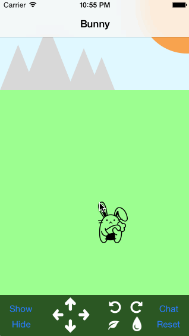

# Furries

Features of the app:

- The move buttons are handled by a single function that moves the bunny in the correct direction based on the button's tag. 
- The move amount depends on the scale of the bunny, and uses a spring animation.  
- The animation is handled by a single `animateTransform()` function. 
- The responses to the entered chat messages come from a random selection of strings.
- The chat keyboard is customized to use the Send button, and is automatically displayed when the screen is shown.  

The login screen wasn't added, as that seemed like a copy-and-paste error from the Facebook exercise above. 

